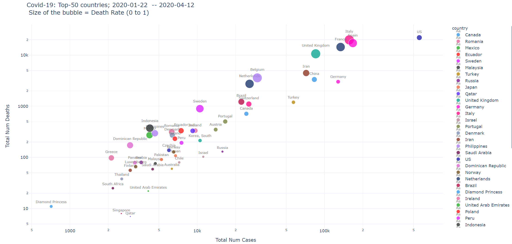

# covid19
Covid-19 related plots

* **Covid-19:Hans Rosling graphs:** 
  * **Journey of top-50 countries** (w.r.t. num cases reported): [View the growth in number of reported cases and number of deaths (Hans Rosling graphs)](https://htmlpreview.github.io/?https://github.com/vinkolar/covid19/blob/master/covid.html).
  * **Journey of US states** (w.r.t. num cases reported): [View the growth in number of reported cases and number of deaths (Hans Rosling graphs)](https://htmlpreview.github.io/?https://github.com/vinkolar/covid19/blob/master/covid_us.html).
* Data from Johns Hopkins repository [here](https://github.com/CSSEGISandData/COVID-19/tree/master/csse_covid_19_data/csse_covid_19_time_series)
* Analysis code [here](corona.ipynb)

# Top finds today for Covid-19 (20 March)
* Country-level summary: See graph [here](https://htmlpreview.github.io/?https://github.com/vinkolar/covid19/blob/master/covid.html) for evolution of num cases and deaths reported 
* US-states level summary: See graph [here](https://htmlpreview.github.io/?https://github.com/vinkolar/covid19/blob/master/covid_us.html) for evolution of num cases and deaths reported 

## Where do countries stand

## Where does US-states stand

## Highlights
### Mar 21
* Denmark, Sweden, Norway is doing well flattening the curve. The curve "seems" to be not growing at the same rate
* Germany has done a great job in containing death rate. It is one of the lowest (0.3%). 
* Num deaths reported for Italy and Spain has not yet stabilized, but death rate has not increased so much
* Death rate seems to have stabilized in most countries

### Mar 20
* No drastic death rate increases in any of the top countries which have been reporting cases for some time
* Phillipines, Japan, Sweden are doing good job in "flattening" the exponential curve
* The rate of cases reported from Taiwan, Singapore and Thailand seems to have increased dramatically. This may be because testing has accelerated, which is good.

### Mar 19
* Number of cases reported in US still is growing expoentially. Num cases reported grew from around 7.7k (yesterday) to 13k (today). This may be because of active testing going on. Good news is that the US death rate is **not** growing; it is steady at 1.4-1.5%
* Italy overtakes China today in number of deaths ableit the huge disparity in respective population numbers
* France and US overtakes South Korea by a large margin -- in terms of number of cases reported
* France death rate grows from around 1.6% to 2.2%. 
* UK death rate climbs from around 2.7% to 5%

## Recent additions
* Mar 20: Exponential fitting of num cases reported. Analysis of exponents of fit

## Disclaimer
These are purely observations from the data provided. Please report if you find anything erroneuous. However, I take no responsibility for correctness or implications since this is just a hobby project I am working on, and dont have resources to polish and verify this. Please use it responsibly. Links for data and code is available in this repository to cross-check. Also, all opinions are mine, and not of my employer or of any other entity.
